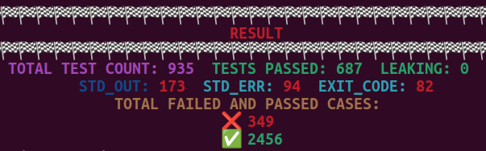
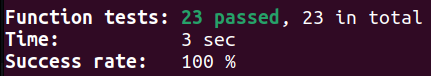

# minishell Useful Tips and Resources

..Readme file WIP(work in process), check later for updates..

# Test Results via 42_minishell_tester

Link to Tester: https://github.com/zstenger93/42_minishell_tester

# Funcheck (malloc protection) Test result:

Link to Tester: https://github.com/tmatis/funcheck

# 

# Installing Readline Library

This repository requires the Readline library to be installed on your system. The Readline library provides line-editing and history capabilities for interactive programs.

## Linux

On Linux, you can install the Readline library using the following commands:

`sudo apt-get update -y && sudo apt-get install libreadline-dev`

If you are using a package manager other than `apt-get`, please refer to the documentation of your package manager for the appropriate installation command.

## macOS

On macOS, you can install the Readline library using Homebrew package manager. If you don't have Homebrew installed, follow the steps below:

1. Open Terminal (located in `/Applications/Utilities/Terminal.app`).

2. Install Homebrew by running the following command:

`/bin/bash -c "$(curl -fsSL https://raw.githubusercontent.com/Homebrew/install/HEAD/install.sh)"`

3. Once Homebrew is installed, you can install the Readline library with the following command:

`brew install readline`

If Homebrew was already installed on your system, you can directly run the above `brew install` command.

---

With the Readline library installed, you should be able to use this repository without any issues. 

Happy coding!
